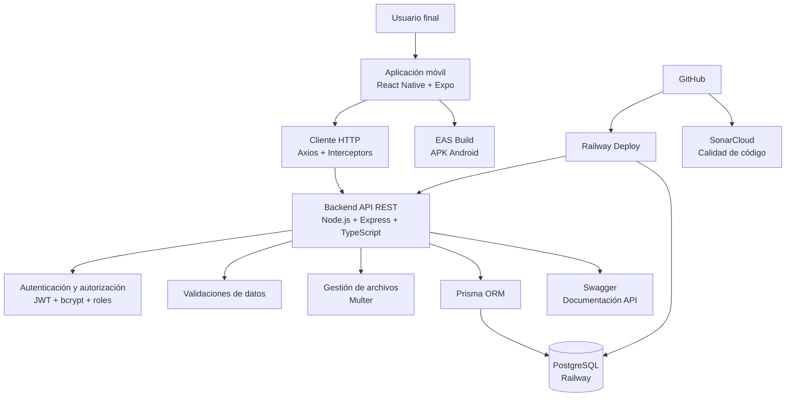

# Diagrama de Componentes

```mermaid
flowchart TB
    User[Usuario final] --> Mobile[Aplicación móvil<br/>React Native + Expo]

    Mobile --> Axios[Cliente HTTP<br/>Axios + Interceptors]
    Axios --> API[Backend API REST<br/>Node.js + Express + TypeScript]

    API --> Auth[Autenticación y autorización<br/>JWT + bcrypt + roles]
    API --> Validators[Validaciones de datos]
    API --> Uploads[Gestión de archivos<br/>Multer]
    API --> Prisma[Prisma ORM]

    Prisma --> DB[(PostgreSQL<br/>Railway)]

    API --> Swagger[Swagger<br/>Documentación API]

    GitHub[GitHub] --> Railway[Railway Deploy]
    Railway --> API
    Railway --> DB

    GitHub --> Sonar[SonarCloud<br/>Calidad de código]
    Mobile --> EAS[EAS Build<br/>APK Android]
```