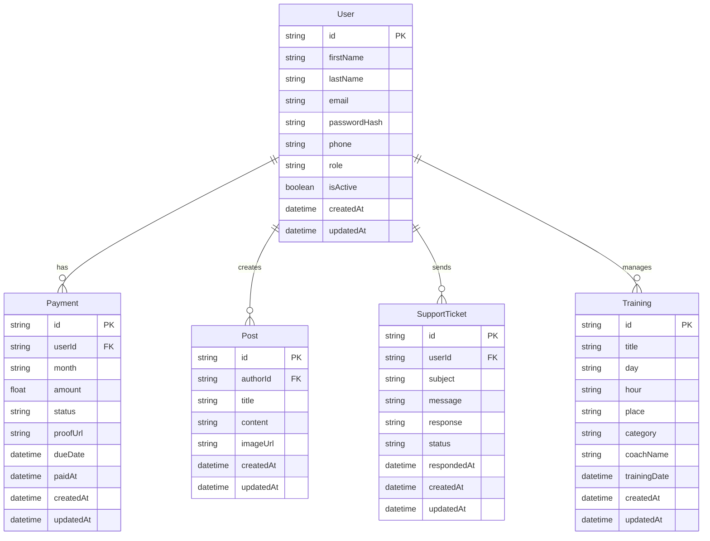

# Diagrama Entidad-Relación

```mermaid
erDiagram
    User ||--o{ Payment : has
    User ||--o{ Post : creates
    User ||--o{ SupportTicket : sends
    User ||--o{ Training : manages

    User {
        string id PK
        string firstName
        string lastName
        string email
        string passwordHash
        string phone
        string role
        boolean isActive
        datetime createdAt
        datetime updatedAt
    }

    Payment {
        string id PK
        string userId FK
        string month
        float amount
        string status
        string proofUrl
        datetime dueDate
        datetime paidAt
        datetime createdAt
        datetime updatedAt
    }

    Post {
        string id PK
        string authorId FK
        string title
        string content
        string imageUrl
        datetime createdAt
        datetime updatedAt
    }

    Training {
        string id PK
        string title
        string day
        string hour
        string place
        string category
        string coachName
        datetime trainingDate
        datetime createdAt
        datetime updatedAt
    }

    SupportTicket {
        string id PK
        string userId FK
        string subject
        string message
        string response
        string status
        datetime respondedAt
        datetime createdAt
        datetime updatedAt
    }
```