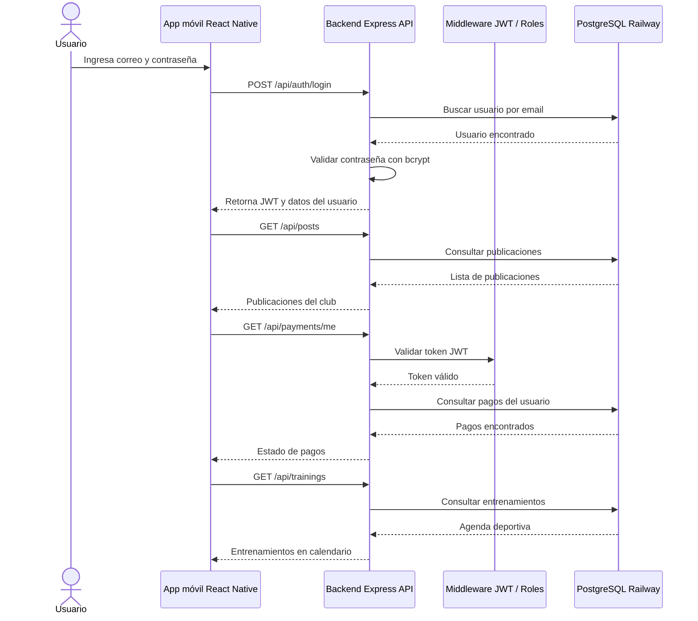

# Diagrama de Secuencia - Flujo principal

```mermaid
sequenceDiagram
    actor Usuario
    participant App as App móvil React Native
    participant API as Backend Express API
    participant Auth as Middleware JWT / Roles
    participant DB as PostgreSQL Railway

    Usuario->>App: Ingresa correo y contraseña
    App->>API: POST /api/auth/login
    API->>DB: Buscar usuario por email
    DB-->>API: Usuario encontrado
    API->>API: Validar contraseña con bcrypt
    API-->>App: Retorna JWT y datos del usuario

    App->>API: GET /api/posts
    API->>DB: Consultar publicaciones
    DB-->>API: Lista de publicaciones
    API-->>App: Publicaciones del club

    App->>API: GET /api/payments/me
    API->>Auth: Validar token JWT
    Auth-->>API: Token válido
    API->>DB: Consultar pagos del usuario
    DB-->>API: Pagos encontrados
    API-->>App: Estado de pagos

    App->>API: GET /api/trainings
    API->>DB: Consultar entrenamientos
    DB-->>API: Agenda deportiva
    API-->>App: Entrenamientos en calendario
```